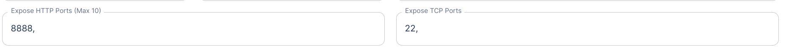

Things your computer needs installed on it outside of the python dependencies:

- runpodctl
  - set it up with your runpod API key and (this one may not be necessary?) give runpod your computer's pubkey
- tmux
- rsync

To create pods from the python:

- in runpod:
   1. create a template
     - make an environment variable PUBLIC_KEY (in the runpod web ui) and set it to your computer's pubkey
     - exposed ports are also important 
       - HTTP: 8888
       - TCP: 22
       -  
   2. create a network volume

- set up template_id and volume_id environment variables *on the local machine that will be running ezpod*:
  - EZPOD_VOLUME_ID
  - EZPOD_TEMPLATE_ID

Optional environment variables:
- EZPOD_POD_VCPU
- EZPOD_POD_MEM
- EZPOD_GPU_TYPE